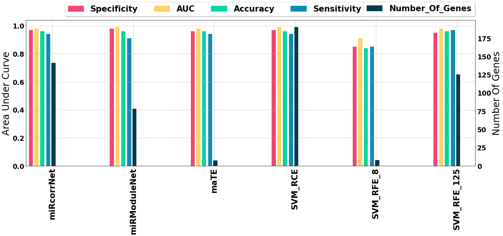

# miRModuleNet
This repository contains the miRModuleNet workflow which is a bioinformatic tool. This tool integrates miRNA and mRNA and generates miRNA-mRNA groups using statistical information. Tool uses these groups to be able to solve classification problem.

## Data Preparation
miRModuleNet uses 2 different data sheets with same control-case column. It means you should have same samples in one column which should be both in mRNA and miRNA data sheet. In this study we used KNIME analytics platform. Therefore, the data is stored in ".table" extension files.

## mRNA Data (Gene Expression)
In mRNA data one should have samples in the rows and gene names in the columns but the type of the genes should be double. The "class" column represents the sample whether control or case. The type of class column should be String and there can be only 2 classes. Below one can see the some chunk of the mRNA data.
 

 
## microRNA Data
In miRNA data one should have samples in the rows and microRNA names in the columns but the type of the genes should be String. The "class" column represents the sample whether control or case. The type of class column should be String and there can be only 2 classes. Below one can see the some chunk of the miRNA data.

 

## Set up Parameters

miRModuleNet allows you to set some parameter values. These parameters : 
- Number of Iterations       (Default :  100)
- Mutual Information Threshold  (Default : 0.25 )

To be able to change these parameters one need to use SetParameters node in the workflow.

## Usage of miRModuleNet and Environment Settings

The only thing one should do is install KNIME Analytics platform. The workflow for miRModuleNet is available. One just download and import that workflow into KNIME. The miRModuleNet workflow contains python and R scripts in it so to avoid any error one need to set up the KNIME Python settings following this path inside KNIME : 
- File -> Preferences -> KNIME(left side of the pop-up) -> Python  
And your R server needs to be (open) running simultaneously when the execution starts. To be able to open this please use following commands in your R / RStudio:
- library("Rserve");
- Rserve(args = "--vanilla")
- In addition to this to be able use rank functionality one need to use RobustRankAggreg package:
- library("RobustRankAggreg");  
If you set all of this environment settings you'll never encounter any error with this stable version of the workflow.

## KNIME WORKFLOW
 
 
 - List Files Node("Node 223"): This node configures the location of the data. One need to give the path of directory which contains mRNA and miRNA data
 - Table Reader("Read mRNA data") : This node finds the "mRNA .table" file in given directory and read those values and put it into a table.
 - SetParameters Node (Node 471): This node configures the workflow parameters.
 - Find_Important_Genes Node (Node 513) : This node finds the statistically important genes.
 - Generate miRNA_mRNA_Modules Node (Node 508) : This node generates the miRNA-mRNA star shaped modules.
 - miRModuleNet Meta-Node (Node 460): This metanode's task is making integrated mRNA-miRNA analysis.

## Solution Approach Steps

1. Data Preprocessing : Data cleaning and Data Normalization(Z-Score).
2. Find Statistically Important mRNAs/miRNAs.
3. Find Differentially Expressed mRNAs and miRNAs.
4. Compute the Mutual Information Score(MIS) between mRNAs and miRNAs and generate the MIS matrix.
5. Detect mRNAs and miRNAs star shaped modules (i.e.,target groups)
6. Rank the star shaped groups
7. Build the model on top ranked clusters
8. Evaluate the model on top ranked clusters

## Comparison of All Methods

